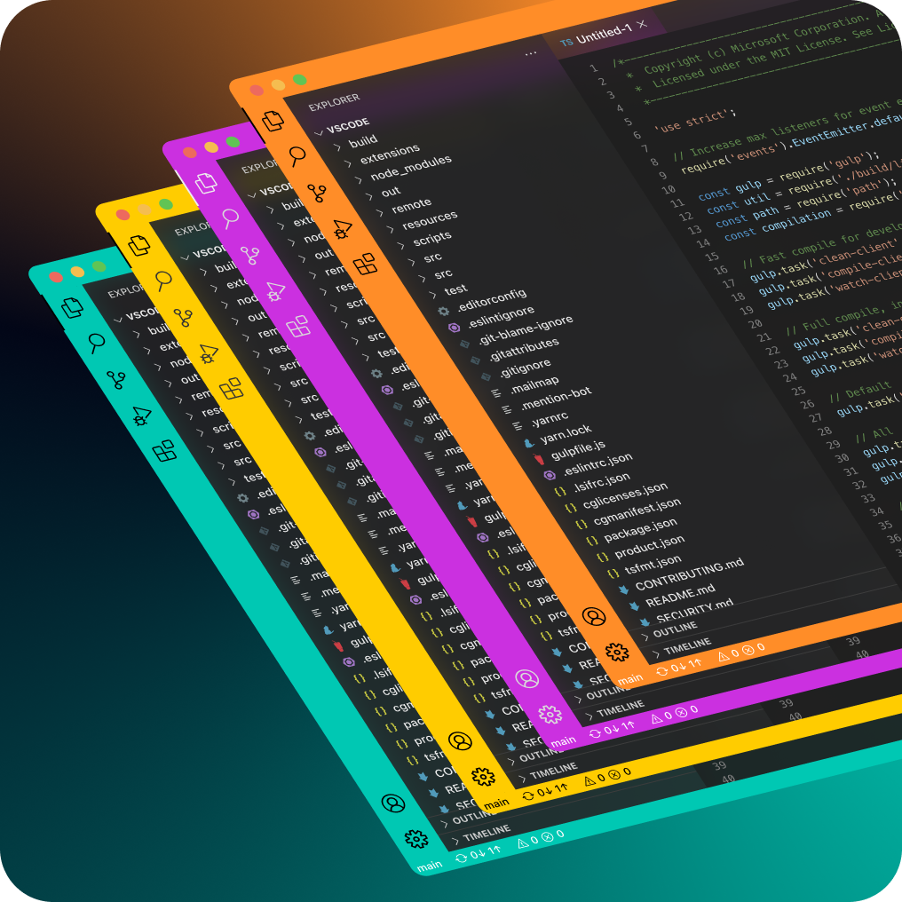

# Auto Project Colors

Reads your project's favicon and applies its dominant color to the VS Code
title bar, activity bar, and status bar. Runs automatically on project load.

[](https://marketplace.visualstudio.com/items?itemName=tomwatts.auto-project-colors)
[](https://marketplace.visualstudio.com/items?itemName=tomwatts.auto-project-colors)
[](https://marketplace.visualstudio.com/items?itemName=tomwatts.auto-project-colors)



> **macOS:** Set `"window.titleBarStyle": "custom"` or title bar coloring won't work.

## Installation

Extensions sidebar → search "Auto Project Colors" → Install. Requires VS Code 1.70.0+.

## No favicon?

For projects without one (backend services, CLIs, libraries):

- `Set Custom Color from Hex Code` — type any hex value
- `Pick Icon File Manually` — point at any image on your machine

## Commands

`Cmd+Shift+P` / `Ctrl+Shift+P`:

| Command | Description |
|---------|-------------|
| `Apply Project Color` | Re-detect favicon and apply |
| `Set Custom Color from Hex Code` | Manual hex input |
| `Pick Icon File Manually` | Use any image file |
| `Regenerate with Different Strategy` | Switch color extraction mode |
| `Choose UI Sections to Color` | Change which bars are colored |
| `Show Current Color Status` | Quick-action dashboard |
| `Revert to Previous Colors` | Restore pre-extension colors |
| `Disable for This Workspace` | Per-workspace toggle |

The status bar shows the active hex code. Click it to open the dashboard.

## Color Extraction

Default mode uses the dominant pixel cluster from a 100×100 resized version
of your favicon. Switch via `Regenerate with Different Strategy`:

- **Dominant** — most prevalent color
- **Vibrant** — increased saturation
- **Muted** — decreased saturation
- **Pastel** — low saturation, high lightness

## UI Sections

Presets via `Choose UI Sections to Color`:

| Preset | Sections |
|--------|----------|
| Minimal | Title bar |
| Balanced | Title bar + activity bar + status bar *(default)* |
| Top & Bottom | Title bar + status bar |
| Maximum | All five sections |

Individual toggles also available in settings.

## Settings

All workspace-scoped under `projectColor.*`:

| Setting | Default | Description |
|---------|---------|-------------|
| `enabled` | `true` | Master toggle |
| `enableAutomaticDetection` | `true` | Auto-apply on workspace open |
| `iconSourceMode` | `"auto"` | `"auto"` or `"manual"` |
| `iconPath` | `""` | Icon path relative to workspace root (manual mode) |
| `iconSearchPatterns` | see below | Glob patterns for favicon search |
| `paletteStrategy` | `"dominant"` | `dominant`, `vibrant`, `muted`, `pastel` |
| `contrastTarget` | `4.5` | WCAG contrast ratio: `3`, `4.5`, or `7` |
| `colorTitleBar` | `true` | |
| `colorActivityBar` | `true` | |
| `colorStatusBar` | `true` | |
| `colorTabBar` | `false` | |
| `colorSideBar` | `false` | |
| `notifyOnApply` | `true` | Notification when colors are applied |
| `maxImageSize` | `5242880` | Max image size in bytes |

### Default search paths

```json
[
  "favicon.ico", "favicon.png", "favicon.svg",
  "public/favicon.ico", "public/favicon.png", "public/favicon.svg",
  "public/icon.png",
  "app/favicon.ico", "app/favicon.png",
  "assets/favicon.ico", "assets/favicon.png",
  "assets/icon.png", "assets/app-icon.png",
  "src/assets/favicon.png", "src/assets/icon.png",
  "static/favicon.ico", "static/favicon.png",
  "resources/favicon.ico", "resources/icon.png",
  "app/assets/images/favicon.ico"
]
